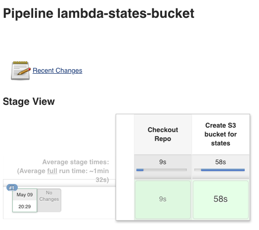
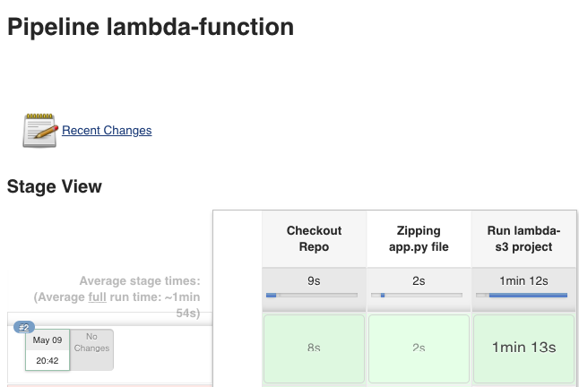
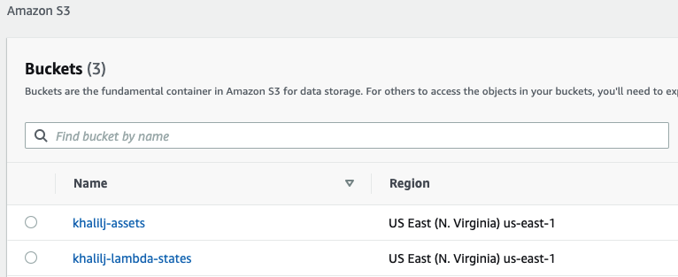

# Lesson 11 BONUS 

## Bonus

*Install Jenkins using Helm:**
* Run: ```helm install jenkins stable/jenkins -f jenkins/my-values.yaml```
* Wait until jenkins pod is ready and running
* Run: ```kubectl port-forward svc/jenkins 8080:8080 &```

**Add AWS Credentials on Jenkins:**
1. Login to Jenkins
    - URL: http://localhost:8080
    - User: admin
    - Password: admin
2. Click on **Credentials** 
3. Click **global**
4. Click **Add Credentials**
5. Fill the following:
    - Kind: **AWS Credentials**
    - ID: **aws-credentials**
    - Access Key ID: \<Your AWS Access Key\>
    - Secret Access Key: \<Your Secret Key\>
6. Click **OK**

**Run the pipeline:**
1. Click **New Item"
2. Enter whatever you want for item name
3. Select Pipeline
4. Click OK
5. Scroll down **Pipeline** section
6. Select **Pipeline script** for Definition
7. Copy the content of **aws-s3.groovy** file and paste it into Script section
8. Click **Save**
9. Click **Build Now**

** Run Pipelines**
1. **Create states bucket**
    - Create new pipeline item
    - Copy ```lambda-states-bucket.groovy``` script content and add it to the Pipeline script section
    - Build the pipeline
    
    
2. **Run lambda-s3 project**
    - Create new pipeline item
    - Copy ```lambda-function.groovy``` script content and add it to the Pipeline script section
    - Build the pipeline
    
    
    
    


